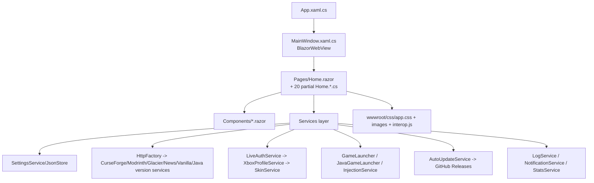
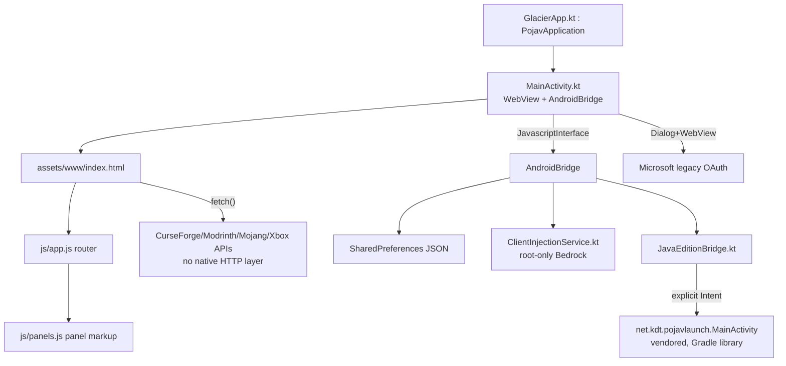

# 01 — Architecture Overview

## Windows (WPF + Blazor Hybrid)

**Entry point:** `App.xaml` / `App.xaml.cs` → `MainWindow.xaml.cs` hosts a `BlazorWebView`
pointed at `wwwroot/index.html`, rendering `Pages/Home.razor` (4,896 lines, 493 `@onclick`
handlers) as the single-page app shell. `Pages/Home.razor.cs` plus 20 partial
`Home.*.cs` files (`Home.Clients.cs`, `Home.Panels.cs`, `Home.Settings.cs`,
`Home.Launch.cs`, etc. — 17,100 combined lines across `Pages/`+`Services/`+`Models/`)
implement the code-behind, split by feature area but all part of one `Home` partial class.

- **Startup flow:** `App.xaml.cs` → `MainWindow` constructed → DI-free service
  instantiation inline in `Home.razor.cs`'s constructor/`OnInitializedAsync` →
  `SettingsService` loads `LauncherSettings` from JSON → `ThemeService` applies
  saved theme → onboarding check → panel router defaults to `home`.
- **UI flow:** one Razor component (`Home.razor`) with a client-side `currentView`
  string driving which of 26 panel bodies renders; `Components/*.razor` supply
  reusable pieces (Modal, Toggle, SkinViewer, ColorPicker, StatsPanel, LogsPanel,
  ModpacksPanel, BackupsPanel, ThemeStudioPanel).
- **Networking:** `Services/HttpFactory.cs` centralizes `HttpClient` creation;
  per-domain services (`CurseForgeService`, `ModrinthService`, `GlacierClientService`,
  `NewsService`, `VanillaVersionService`, `JavaVersionService`) each own their own
  base URL/parsing. `Services/GitHubApiCache.cs` caches GitHub API responses.
- **Auth:** `Services/LiveAuthService.cs` + `LiveAuthWindow.xaml.cs` drive Microsoft
  legacy OAuth (`oauth20_desktop.srf` redirect capture) → `Services/XboxProfileService.cs`
  chains Xbox Live user auth → XSTS (Xbox + Minecraft relying parties) → Minecraft
  profile → persisted into `LauncherSettings`.
- **Settings:** `Services/SettingsService.cs` + `Services/JsonStore.cs` — single JSON
  blob on disk (`LauncherSettings` model), loaded once, saved on mutation.
- **Update system:** `Services/AutoUpdateService.cs` (305 lines) — checks GitHub
  Releases, downloads, applies self-update, in-app modal (`OpenUpdateModal`/
  `ApplyLauncherUpdate`/`SkipLauncherUpdate`/`ManualUpdateCheck` in `Home.razor`).
- **Launching:** `Services/GameLauncher.cs` (Bedrock, 425 lines) and
  `Services/JavaGameLauncher.cs` (811 lines) each own process-spawn logic;
  `Services/InjectionService.cs` (294 lines) does DLL injection
  (`CreateRemoteThread`+`LoadLibrary`) into `Minecraft.Windows.exe` for
  Flarial/Latite/OderSo/LeviLamina.
- **Caching/assets:** `wwwroot/css/app.css`, `wwwroot/images/`, `wwwroot/js/interop.js`
  (referenced by README as the source `ensureTabCyclers()`/theme functions were
  ported from) serve the UI; `Services/GitHubApiCache.cs` and per-service in-memory
  caches avoid refetching version manifests.
- **Telemetry/diagnostics:** `Services/LogService.cs`, `Services/LaunchDiagnosticsService.cs`,
  `Services/StatsService.cs`, `Services/NotificationService.cs` (in-app event log —
  crash detection, update checks), `TrayIcon.cs` (system tray), `GameConsoleWindow.xaml(.cs)`
  + `Services/GameConsoleService.cs` (live game log window).

## Android (WebView shell + vendored PojavLauncher)

**Entry point:** `android/app/src/main/java/xyz/glacierclient/launcher/GlacierApp.kt`
(14 lines — extends `net.kdt.pojavlaunch.PojavApplication`, not plain `Application`,
so Pojav's crash handler / `LauncherPreferences.loadPreferences()` / JRE unpack run
first) → `MainActivity.kt` (186 lines) hosts one full-screen `WebView` loading
`file:///android_asset/www/index.html` (125 lines, mirrors `Home.razor`'s
top-bar/main-content/footer markup), landscape-locked, immersive fullscreen.

- **Native bridge:** `AndroidBridge` (a `@JavascriptInterface` object inside
  `MainActivity.kt`) exposes root checks, Bedrock/Java launch calls, and
  settings persistence to JS; `js/bridge.js` (21 lines) wraps it with a
  browser-safe fallback so `index.html` opens standalone for layout iteration.
- **UI flow:** `js/app.js` (994 lines) is the JS port of `Home.razor.cs`'s
  `currentView` + `OpenXxx()` router; `js/panels.js` (1,253 lines) holds panel
  body markup ported line-for-line from `Pages/Home.razor` panel blocks.
- **Java Edition:** `android/pojavlauncher` (git submodule, unmodified upstream)
  built as a Gradle **library** into `:app` via `scripts/rebrand-pojav.sh` +
  `scripts/patch_pojav_gradle.py` (brace-depth-aware Groovy patcher — converts
  `com.android.application`→`library`, retargets package/authority resValues,
  strips a duplicate `LAUNCHER` intent-filter). `service/JavaEditionBridge.kt`
  (71 lines) launches `net.kdt.pojavlaunch.MainActivity` directly via explicit
  `Intent`, passing the selected version through `INTENT_MINECRAFT_VERSION`.
- **Bedrock injection:** `service/ClientInjectionService.kt` (80 lines) —
  root-only best-effort staging; README's 2026-08-28 gap analysis identifies a
  real non-root path (package-context + `dlopen()`, per Minimal-Launcher /
  LeviLaunchroid prior art) as a scoped future task, not yet implemented.
- **Networking:** direct browser `fetch()` from the WebView's `file://` origin
  in `js/curseforge.js`, `js/modrinth.js`, `js/xboxauth.js`, `js/skinlibrary.js`,
  `js/javaedition.js` — no native HTTP client, no shared cache layer, no retry/
  backoff wrapper (each file reimplements its own fetch calls).
- **Auth:** native `Dialog`+`WebView` OAuth capture in `MainActivity.kt`
  (same legacy Microsoft endpoint/`client_id` as desktop) → `js/xboxauth.js`
  (147 lines) mirrors `LiveAuthService`/`XboxProfileService` token-exchange
  chain client-side.
- **Settings:** `AndroidBridge` → `SharedPreferences`-backed JSON (no shared
  schema/model file with desktop's `LauncherSettings.cs` — field names are
  duplicated by convention across `js/app.js` and Kotlin, not shared code).
- **Theming:** `js/theme.js` (128 lines) ports `ThemeDefinition.cs`'s
  `BuildCssVars()` math and desktop's `interop.js` theme functions; persists
  to `localStorage` rather than a settings blob (matches desktop's separate
  `themes.json` file conceptually).
- **Update system:** none — Play Store / new-APK only; no in-app updater
  (`AutoUpdateService.cs` has no Android counterpart by design).
- **Telemetry:** none — no `LogService`/`NotificationService`/`StatsService`
  equivalent; Stats/Logs panels render honest empty states.

## Key structural asymmetries
- Windows has a service layer (40+ classes under `Services/`) with DI-free but
  clean separation; Android has 4 Kotlin files total and pushes nearly all
  logic into `js/*.js`, which has no equivalent test/type safety and no
  shared model layer with the Kotlin side.
- Windows persists one strongly-typed `LauncherSettings` JSON via `JsonStore`;
  Android persists ad-hoc keys through `SharedPreferences` with no schema.
- Windows has a real update/telemetry/diagnostics stack; Android has none of
  the three (each a deliberate, documented gap — see `03_MISSING_FEATURES.md`).
</content>
